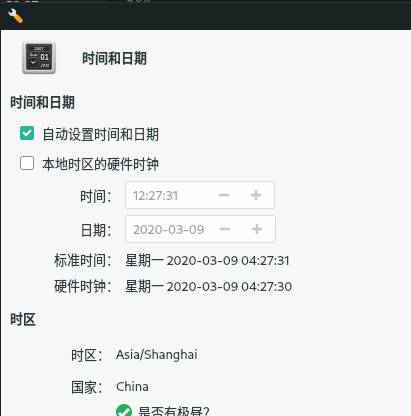

[TOC]
# Check version

```shell
cat /etc/lsb-release
```

# Turn off Windows 10 fast boot

In control pannel, power management.

# pacman

## Mirrors

Mirrors can be managed using <code>pacman-mirrors</code> command, with official illustration [here](https://wiki.manjaro.org/index.php?title=Pacman-mirrors).

Manjaro mirror list can be obtained from [web](https://repo.manjaro.org/)

### Update all mirror

1. One can get the newest mirror from [net](https://www.archlinux.org/mirrorlist/?country=all&protocol=http&protocol=https&ip_version=4&ip_version=6), then insert into <code>/etc/pacman.d/mirrorlist</code>.

2. One can use the following command to auto update mirrors:
   ```shell
   sudo pacman-mirrors -c all
   ```

### Change Chinese Mirror

1. Configure Chinese mirror:
   ```shell
   sudo pacman-mirrors -i -c China -m rank
   ```

2. Choose "tsinghua" mirror in poped out window:
   

3. Open <code>/etc/pacman.conf</code>:
   ```shell
   sudo code /etc/pacman.conf
   ```

4. At the end, type in:
   ```shell
   [archlinuxcn]
   SigLevel = Optional TrustedOnly
   Server = http://repo.archlinuxcn.org/$arch
   ```

5. Update package list:
   ```shell
   sudo pacman -Syy
   ```

6. Sync package and updates:
   ```shell
   sudo pacman -Syu
   ```

## Install archlinuxcn-keyring

```shell
sudo pacman -S archlinuxcn-keyring
```

## command

### List installed files for specific package

```shell
pacman -Q -l <pkg name>
```

### List dependency of a package

```shell
pactree <pkg name>
```

### Remove all downloaded packages

```shell
pacman -Sc
```

# NordVPN

Using openvpn(installed already):

## Change DNS to NordVPN DNS

1. Open <code>/etc/resolv.conf</code> :

   ```shell
   sudo code /etc/resolv.conf
   ```

2. Remove everything and type in the following and save:

   ```
   nameserver 103.86.96.100
   nameserver 103.86.99.100
   ```

## Connecting

1. Connecting using openvpn using one of the configuration file from <code>ls ./OpenVPN/</code>:

   ```shell
   sudo openvpn --config ./OpenVPN/us7097.nordvpn.com.udp.ovpn
   ```
2. Type in account info:
   
   ```shell
   Username: 
   Password: 
   ``` 

## Change back to normal DNS

Open <code>/etc/resolv.conf</code> , remove everything and type in  :

```conf
# Generated by NetworkManager
nameserver 192.168.0.1
```

## Strongswan servers

```
172.104.106.200 - jp598.nordvpn.com
139.162.111.224 - jp599.nordvpn.com
139.162.118.94 - jp599.nordvpn.com
45.79.111.177 - us5783.nordvpn.com
45.79.111.208 - us5784.nordvpn.com
45.79.64.4 - us5784.nordvpn.com
45.79.64.48 - us5783.nordvpn.com
178.79.134.237 - uk2326.nordvpn.com
109.74.193.212 - uk2326.nordvpn.com
176.58.98.210 - uk2326.nordvpn.com
```

# Chromium keyring

After insalling <code>archlinuxcn-keyring</code> each time open chromium first time will asking for password:


The following are steps to disable this:

1. Install <code>seahorse</code>:
   ```shell
      sudo pacman -S seahorse
   ```
2. Open seahorse and <code>mouse-right</code> "默认秘钥环" and choose "更改密码"：
   
3. Type in old pass word, and input nothing in the new password setting.
4. Press OK for non password setting, and reboot.

# VS-Code font

1. Install <code>ttf-droid-min</code> fonts package from AUR
2. Reboot


# Snip tool

Using <code>screenshooter</code>, in terminal:

```shell
screenshooter
```

For screen shoot need operations, using delay time setting.

# GitHub

## Pre-installation

Install <code>git</code>, <code>openssh</code> and <code>libssh</code> 

## Config git

Configure git user name and email by following:

```shell
git config --global user.name "shore"
git config --global user.email "372660931@qq.com"
```

## Remote

1. Create repository in [GitHub](https://github.com/)
2. Record SSH address
3. Initialize local git repository
   ```shell
   git init
   ```
4. Add remote
   ```shell
   git remote add <remote-name> <ssh-address>
   ```

## Create SSH

Type in:

```shell
ssh-keygen -t rsa -C "372660931@qq.com"
```

Input the destination for genarated SSH key:

```shell
Enter file in which to save the key (/home/shore/.ssh/id_rsa): /home/shore/tt.txt
```

For <code>passphrase</code>, using defualt by not typing anything and press <code>Enter</code> for 3 times.

Output would be 2 files: <code>tt.txt</code> for private key and <code>tt.txt.pub</code> for public key.

## Adding new SSH-key in GitHub

Login GitHub and navigate to personal settings. Click on <code>SSH and GPG keys</code> tab and press <code>New SSH key</code>

Copy content of <code>tt.txt.pub</code> and press <code>Add SSH key</code>:


## Clong Repository

Create new repository or find url for existting one under the account, using git clone to clone the repository:

```shell
git clone https://github.com/Shoreshen/Hello.git
```

## Commit and upload

Commit changings by:

```shell
git add -A
git commit -m "message for commit"
```

Push to GitHub by:

```shell
git push origin master
```

Then type in usename and password.

## Establish remote connection
 
```shell
git remote add origin https://github.com/Shoreshen/Hello.git
```

## Ignore

To ignore files under git workspace, create ignore file:

```shell
touch ./.gitignore
```

Add entries to ignore:

```python
.vscode-ctags #specific file

/edk2/ #Ignore all files under directory ./edk2
```

To remove already tracked file, need to reset cache

```shell
git rm -r --cached .
git add .
git commit -m"update .gitignore"
```

## Submoduel

If there exists submodule, git will not automatically clone them.

To clone all submodules using the following command:

```shell
git submodule update --init --recursive
```

To add submodule using

```shell
git submodule add <URL> <PATH>
```

To remove submodule:

1. Remove relative entries in <code>./.gitmodules</code>
2. Stage change <code>git add .gitmodules</code>
3. Remove relative entries in <code>.git/config</code>
4. Run <code>git rm --cached <path/to/submodule></code>
5. Remove file <code>rm -rf .git/modules/<path/to/submodule></code>
6. Commit all changes <code>git commit -m "Removed submodule"</code>
7. Delete the now untracked submodule files <code>rm -rf <path/to/submodule></code>

## Command

### submodual

Documentation in [this](https://git-scm.com/docs/git-submodule) link.

To first time recursively (including submoduals of submodual) download submoduals:

```shell
git submodule update --init --recursive
```

To set defualt submodule branch:

```shell
git submodule set-branch --branch <branch name> <submodule path>
```

To execute command for each submodual recursively:

```shell
git submodule foreach --recursive '<git command>'
```

The following command pull the submodules to the latest commit of parent reporsitoy. Not the latest commit of submodule repositories.

```shell
git pull --recurse-submodules=yes origin master
```
e.g.: 
   *For commit A_1 of rep A, submodule B is at B_1. If rep B has newer commit B_2 and rep A remains, the command will only pull A_1 for rep A and B_1 for rep B.4
      Which is the same commit as of A to submodule B.*

### Compare

Documentation in [this](https://git-scm.com/docs/git-diff) link.

Disable scroll and diff session:

```
git config --global core.page cat
```

List all commit IDs:

```
git log
```

Compare same file in different commits:

```shell
git diff <CommitID> <CommitID> <Path/to/File>
```

Output to file:

```shell
git diff --output=<Path/to/log> <CommitID> <CommitID> <Path/to/File>
```

# Terminal

## Terminal font

Install <code>nerd-fonts-terminus</code> package:

```shell
pacman -S nerd-fonts-terminus
```

In terminal, select "Edit->Preference->Appearance", select "TerminessTTF Nerd Font Mono Medium" font:


## find instruction

Gramma as follow:

```shell
find <dir> -name <file name>
```

<code>file name</code> can use "*" or "%" to represent uncertain characters.

# Onedrive

## Install Rclone

```shell
sudo pacman -S rclone
```

## Config Rclone

Start configure by:

```shell
rclone config
```

Pop out the following options:

```shell
$ rclone config
Current remotes:

Name                 Type
====                 ====
mega                 mega

e) Edit existing remote
n) New remote
d) Delete remote
r) Rename remote
c) Copy remote
s) Set configuration password
q) Quit config
e/n/d/r/c/s/q>
```

Choose <code>n</code> for creating new remote.

<a id = "remotename"></a>
Type in the <code>name</code> would like to call the remote:

```shell
name> onedrive
```

Select the number with illustration of "Microsoft OneDrive":

```shell
...
19 / Microsoft OneDrive
   \ "onedrive"
...
Storage> 19
```

Next two steps, press Enter without entering any information since there's no need to enter the Microsoft App Client ID or Secret:

```shell
Microsoft App Client Id
Leave blank normally.
Enter a string value. Press Enter for the default ("").
client_id> 
Microsoft App Client Secret
Leave blank normally.
Enter a string value. Press Enter for the default ("").
client_secret> 
```

Enter "n" for advanced config:

```shell
Edit advanced config? (y/n)
y) Yes
n) No
y/n> n
```

Type "y" for auto configuration:

```shell
Use auto config?
 * Say Y if not sure
 * Say N if you are working on a remote or headless machine
y) Yes
n) No
y/n> y
```

A new tab should open in your default web browser, asking you to give Rclone access to your OneDrive account. Allow it and you can close the tab.

Rclone runs a webserver on your local machine (on port 53682) to retrieve the authentication token. You may need to unblock it temporarily if you use a firewall.

Type in "1" to choose "OneDrive Personal or Business" account:

```shell
Choose a number from below, or type in an existing value
 1 / OneDrive Personal or Business
   \ "onedrive"
 2 / Root Sharepoint site
   \ "sharepoint"
 3 / Type in driveID
   \ "driveid"
 4 / Type in SiteID
   \ "siteid"
 5 / Search a Sharepoint site
   \ "search"
Your choice> 1
```

Type "0" to choose the only existing account:wen

```shell
Found 1 drives, please select the one you want to use:
0:  (personal) id=f119f51f0a00000
Chose drive to use:> 0
```

Enter "y" to confirm url and "y" to confirm configuration setting:

```shell
Found drive 'root' of type 'personal', URL: https://onedrive.live.com/?cid=0f119f51f000000
Is that okay?
y) Yes
n) No
y/n> y
[onedrive]
type = onedrive
token = {"access_token":"GoKSt5YMioiuCWX1KOuo8QT0Fwy+Y6ZeX7M","token_type":"bearer","refresh_token":"7OMvoEAO3l*8BbhS2AMxpTbJW0Y6np9cdql!bwEdYAhJ6XBG0tnR0UK","expiry":"2018-07-26T15:15:13.696368366+03:00"}
drive_id = f119f51f0a00000
drive_type = personal
--------------------
y) Yes this is OK
e) Edit this remote
d) Delete this remote
y/e/d> y
```

Lastly enter "q" to quit configuration.

## Rclone sync

To copy files from or to onedrive, use <code>rclone sync</code> command:

```shell
rclone sync onedrive:OSFiles ~/OneDrive/OSFiles
```

To push the local change into onedrive:

```shell
rclone sync ~/OneDrive/manjaro_note onedrive:manjaro_note
```

1. <code>onedrive:OSFiles</code>: Configured remote address: 
   <code>onedrive</code>: The [remote name](#remotename) selected during configuration.
   <code>OSFiles</code>: The sub-directory
   <code>:</code>: Indicating it is a remote directory
2. <code>~/OneDrive/OSFiles</code>: Local directory

## Rclone mount

Mount onedrive to local file directory:

```shell
rclone --vfs-cache-mode full mount onedrive: ~/OneDrive
```

# Install Fcitx (Chinese input method)
   
```shell
sudo pacman -S fcitx-lilydjwg-git fcitx-configtool fcitx-sogoupinyin
```

# Emacs

## Install

From <code>pacman</code>:

```shell
pacman -S emacs
```

## Enable Sogou(fcitx)

1. Open <code>~/.profile</code>:
   ```shell
   code ~/.profile
   ```
2. At the end of the file, type in:
   ```shell
   export GTK_IM_MODULE=fcitx
   export QT_IM_MODULE=fcitx
   export XMODIFIERS=@im=fcitx
   export LC_CTYPE=zh_CN.UTF-8
   ```

## Latex

Install <code>texlive</code> by:

```shell
pacman -S texlive-core texlive-langchinese
```

## Themes

Press <code>M-x</code> and type in <code>load-theme</code> and use <code>Up</code> or <code>Down</code> to select themes.

Current theme: tango-dark.

## Presettings

### Latex function size

1. Press <code>M-x</code> and type in <code>customize variable</code>
2. Type in <code>org format latex options</code> with <code>Enter</code>
3. Find key <code>scale</code> adjust corresponding value to <code>1.5</code>
4. Press <code>Apply and Save</code> button

### Packages

#### List

Press <code>M-x</code> and type in <code>list-package</code> to list the available pakcages.

#### Add "Melpa" archive

To import melpa pakcages archive, follow the following steps:
<a id = "mk1"></a>
1. Press <code>M-x</code> and type in <code>customize variable</code>
2. Type in <code>package archives</code> with <code>Enter</code>
3. Press <code>INS</code> to add new achive with name "melpa" and URL "http://melpa.org/packages/"
4. Press <code>Apply and Save</code> button

This will not only add new source, also create [.emacs](#emacs) configuration file.

#### Install packages

To refresh melpa archive package list, need to connect to [VPN](#nordvpn)

[List](#list) packages, select the ones that need to be installes.

Current needed packages:

```emacs
neotree            20181121.2026 installed             A tree plugin like NerdTree for Vim
org-bullets        20190802.927  installed             Show bullets in org-mode as UTF-8 characters
```

#### neotree

Neotree window not resizable by default. need to add <code>(setq neo-window-fixed-size nil)</code> in <code>.emacs</code> file

### .emacs

New installed Emacs do not have presetting file.

Create <code>.emacs</code> file under <code>~/</code> directory or manually [customize variable](#mk1) will also auto-create <code>.emacs</code> file.

The following is the current settings:

```emacs
;; Added by Package.el.  This must come before configurations of
;; installed packages.  Don't delete this line.  If you don't want it,
;; just comment it out by adding a semicolon to the start of the line.
;; You may delete these explanatory comments.
(package-initialize)

(custom-set-variables
 ;; custom-set-variables was added by Custom.
 ;; If you edit it by hand, you could mess it up, so be careful.
 ;; Your init file should contain only one such instance.
 ;; If there is more than one, they won't work right.
 '(desktop-save t)
 '(desktop-save-mode t)
 '(org-format-latex-options
   (quote
    (:foreground default :background default :scale 0.8 :html-foreground "Black" :html-background "Transparent" :html-scale 1.0 :matchers
		 ("begin" "$1" "$" "$$" "\\(" "\\["))))
 '(org-startup-indented t)
 '(package-archives
   (quote
    (("gnu" . "https://elpa.gnu.org/packages/")
     ("melpa" . "http://melpa.org/packages/"))))
 '(package-selected-packages (quote (org-bullets neotree))))
(custom-set-faces
 ;; custom-set-faces was added by Custom.
 ;; If you edit it by hand, you could mess it up, so be careful.
 ;; Your init file should contain only one such instance.
 ;; If there is more than one, they won't work right.
 )

;;Org bullets activation
(require 'org-bullets)
(add-hook 'org-mode-hook 'org-bullets-mode)
;;NeoTree activation
(require 'neotree)
(global-set-key [f8] 'neotree-toggle)
(neotree-dir "/home/shore/OneDrive")
(setq neo-window-fixed-size nil)
;;Org-mouse activation, expand on click of section
(require 'org-mouse)
;;Disable Ctrl+Space for switching input method
(global-set-key (kbd "C-SPC") nil)
```

# Download

Use qbittorrent

```shell
sudo pacman -S qbittorrent
```

# Graphic

## Install Nvidia Drive

Select proper drive from [here](https://forum.manjaro.org/t/options-for-nvidia-optimus-graphics/75185).

Install from "manjaro-settings-manager":

```shell
manjaro-settings-manager
```

And pick select the correct drive:


Or use the following command:

```shell
sudo mhwd -i pci video-nvidia-440xx
```

## Preventing GPU falling off the bus

Need to set performance mode of GPU, which can be done by:

```shell
/usr/bin/nvidia-settings -a "[gpu:0]/GpuPowerMizerMode=1"
```

To avoid operating every boot, add this into the bootup option:


## Configuration

From [here](https://forum.manjaro.org/t/options-for-nvidia-optimus-graphics/75185) select the correct link for drive. What installede here is [nvidia-prime](https://forum.manjaro.org/t/howto-set-up-prime-with-nvidia-proprietary-driver/40225).

Follow the instruction and reboot.

## Dual screen

### Configuration

1. Install "xrandr"
   ```shell
   sudo pacman -S lxrandr
   ```
2. Plug in HDMI/DP or other port, if screen displays, retrive device name by：
   ```shell
   xrandr -q
   ```
3. Configure as second screen when connected:
   ```shell
   xrandr --output HDMI-0 --auto --right-of DP-2
   ```

### Save setting

Connect the second screen and start up nvidia-settings:

```shell
sudo nvidia-settings
```

Select "X Server Display Configuration", pick the second screen and press "Save to X Configuration File":


# Softwares

## Octave

Install by:

```shell
sudo pacman -S octave
```

## Wangyi yun music

Install by:

```shell
sudo pacman -S netease-cloud-music
```

## Calculator

Install by:

```shell
sudo pacman -S gnome-calculator
```

## Pdf viewer

Install by:

```shell
sudo pacman -S evince
```

## Hex viwer

Install by:

```shell
sudo pacman -S ghex
```

## Sunloginclient(向日葵)

Search <code>sunloginclient</code> from AUR subsidiary and build.

Need to enable remote control and start sunlogin service each reboot:

```shell
xhost + && echo $(PW) | sudo -S systemctl start runsunloginclient
```

Start sunloginclient.

## PostgreSQL

### Installatiion

From pacman:

```shell
sudo pacman -S postgresql
```

### Initialization DB

Database need to be initialized:

```shell
sudo -iu postgres
initdb -D /var/lib/postgres/data
```

### Start postgres service

```shell
sudo systemctl enable postgresql.service # Start service at boot
sudo systemctl start postgresql.service # Start service now
```

### Upgrade

Once major version is updated, the data created will not be compatible.

To migrate the existing data, should apply step in [here](https://wiki.archlinux.org/index.php/PostgreSQL#Upgrading_PostgreSQL).

Major steps are listed follow:

1. Stop postgresql service:
   ```shell
   systemctl stop postgresql.service
   systemctl status postgresql.service #Make sure service were stopped
   ```
2. Upgrade postgresql and install upgrading package
   ```shell
   sudo pacman -S postgresql postgresql-libs postgresql-old-upgrade
   ```
3. Copy & create relative directorys and change owner
   ```shell
   sudo mv /var/lib/postgres/data /var/lib/postgres/olddata
   sudo mkdir /var/lib/postgres/data /var/lib/postgres/tmp
   sudo chown postgres:postgres /var/lib/postgres/data /var/lib/postgres/tmp
   cd /var/lib/postgres/tmp
   ```
4. Switch user and initilize new database for current postgresql
   ```shell
   sudo -iu postgres
   initdb -D /var/lib/postgres/data
   ```
5. Using "pg_upgrade" to migrate the old data, <code>PG_VERSION</code> refers to the old version, should be same as indicated from <code>postgresql-old-upgrade</code> package:
   ```shell
   pg_upgrade -b /opt/pgsql-PG_VERSION/bin -B /usr/bin -d /var/lib/postgres/olddata -D /var/lib/postgres/data
   ```
6. Clean old data, start service, re-analyze optimizor and switch back user
   ```shell
   sudo ./delete_old_cluster.sh
   systemctl start postgresql.service
   systemctl status postgresql.service
   ./analyze_new_cluster.sh
   su shore
   ```
## pulse-secure

Install from AUR package:

```shell
sudo pamac install pulse-secure
```

Enable/start service

```shell
sudo systemctl enable pulsesecure.service
sudo systemctl start pulsesecure.service
```

Need reboot to take effect.

## UniVPN

Download the linux version from [leagsoft](https://www.leagsoft.com/) at this [link](https://www.leagsoft.com/new-detail/1087)

Unzip it and find file `univpn-linux-64-XXXXX.X.X.XXXX.run` and replace the line ``ARCH="`arch`"`` with ``ARCH="`uname -m`"`` (use a hex editor, normal editor will disable the file)

Change the atrribute and run the file

```shell
chmod 755 univpn-linux-64-10781.9.0.1229.run
sudo ./univpn-linux-64-10781.9.0.1229.run
```

# Time

Open <code>Manjaro-Settings-Manager</code>, double click <code>时间和日期</code>. Make sure settings are as following:



# Enable AUR

1. Open <code>pamac-manager</code>
   ```shell
   pamac-manager
   ```
2. Select [首选项] from top right corner
   
3. Select [AUR] tab, tick the enable option
   

# Teamviewer

Install teamviewer

```shell
sudo pacman -S teamviewer
```

Run the following command:

```shell
sudo teamviewer --daemon enable
```

# Install pip

1. Download installation file:
   ```shell
   curl https://bootstrap.pypa.io/get-pip.py -o get-pip.py
   ```
2. Run installation file:
   ```shell
   python get-pip.py
   ```

# Viewing system log

## Install QJournalctl

```shell
sudo pacman -S QJournalctl
```

# Docker

## Install

Install docker by:

```shell
sudo pacman -S docker
```

Start docker service by:

```shell
sudo systemctl start docker
```

Check information (after start docker service):

```shell
sudo docker info
```

Add docker to no-root user

```shell
sudo groupadd docker
sudo usermod -aG docker $USER
```

## login quay.io

```shell
docker login quiy.io
Username: shoreshen
Password: Gx4HEW57hB3R/fG6bwZpw2AmJk5HqM4Upou2LEqjVtUqJN9I+o/Gh1qURBTqP+BL
```

To generate a new cli password, goto [this web](#https://quay.io/) and login


## With VS-Code

1. To enable specific function on remote, need to install AUR's official VS-Cdoe package <code>visual-studio-code-bin</code>
2. Install <code>Docker</code> extension.
3. Install <code>Remote Development</code> vscode extension package

## Command

View running containors:

```shell
docker ps
```

View all containors:

```shell
docker ps -a
```

List all images:

```shell
docker images
```

Remove image:

```shell
docker rmi <IMAGE ID>
```

Stop running containor:

```shell
docker stop <CONTAINER ID>
```

Stop all running containors:

```shell
docker rm $(docker ps -a -q)
```

Commit containor into image:

```shell
docker commit <CONTAINER ID> <Image Name>
```

Download [manylinux1](https://quay.io/repository/pypa/manylinux1_x86_64?tag=latest&tab=tags) image:

```shell
docker pull quay.io/pypa/manylinux1_x86_64:latest
```
Running docker image into terminal:

```shell
docker run -it --rm -e PLAT=manylinux1_x86_64 -v `pwd`:/io quay.io/pypa/manylinux1_x86_64 /bin/bash
```

Running docker image on background:

```shell
docker run -itd --user "$$(id -u):$$(id -g)" -e PLAT=manylinux1_x86_64 -v `pwd`:/io quay.io/pypa/manylinux1_x86_64 /bin/bash
```

|Option|Illustration|
|-|-|
|-it|Creating an interactive bash shell in the container|
|--rm|Automatically remove the container when it exits|
|-v \`pwd\`:/io|Map current host directory into Docker directory:/io/ |
|quay.io/pypa/manylinux1_x86_64|Docker image name|
|/bin/bash|Run into bash, allow terminal conversation|
|PLAT=manylinux1_x86_64|Define $PLAT variable|
|--user "UID:GID"|run command with user id as "UID" and group id as "GID"|

Exit running docker image in terminal:

```shell
[root@68fbe0dda3ea /]# exit
exit
```

## Example on compile manylinux pandas

1. Download pandas 0.24.2 source code [here](https://files.pythonhosted.org/packages/b2/4c/b6f966ac91c5670ba4ef0b0b5613b5379e3c7abdfad4e7b89a87d73bae13/pandas-0.24.2.tar.gz).

2. Run docker manylinux_x86_84 image

```shell
docker run -it --rm -e PLAT=manylinux1_x86_64 -v `pwd`:/io quay.io/pypa/manylinux1_x86_64 /bin/bash
```

3. Move file and unzip

```shell
cp /io/pandas-0.24.2.tar.gz /home/
cd home
tar -zxvf pandas-0.24.2.tar.gz
```

4. Use narrow-unicode python 2.7.x to create wheel

```shell
cd pandas-0.24.2
/opt/python/cp27-cp27m/bin/python setup.py bdist_wheel
```

5. Repair the wheel file and output to host directory

```shell
auditwheel repair dist/pandas-0.24.2-cp27-cp27m-linux_x86_64.whl --plat manylinux1_x86_64 -w /io/
```

# Stop system beep

```shell
xset -b
```